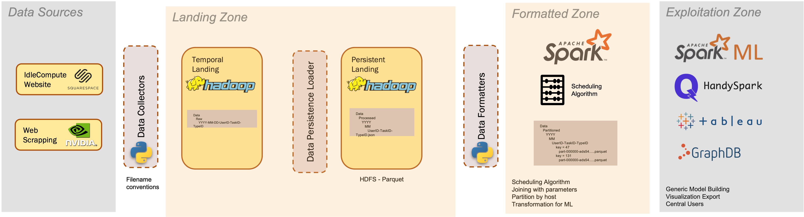
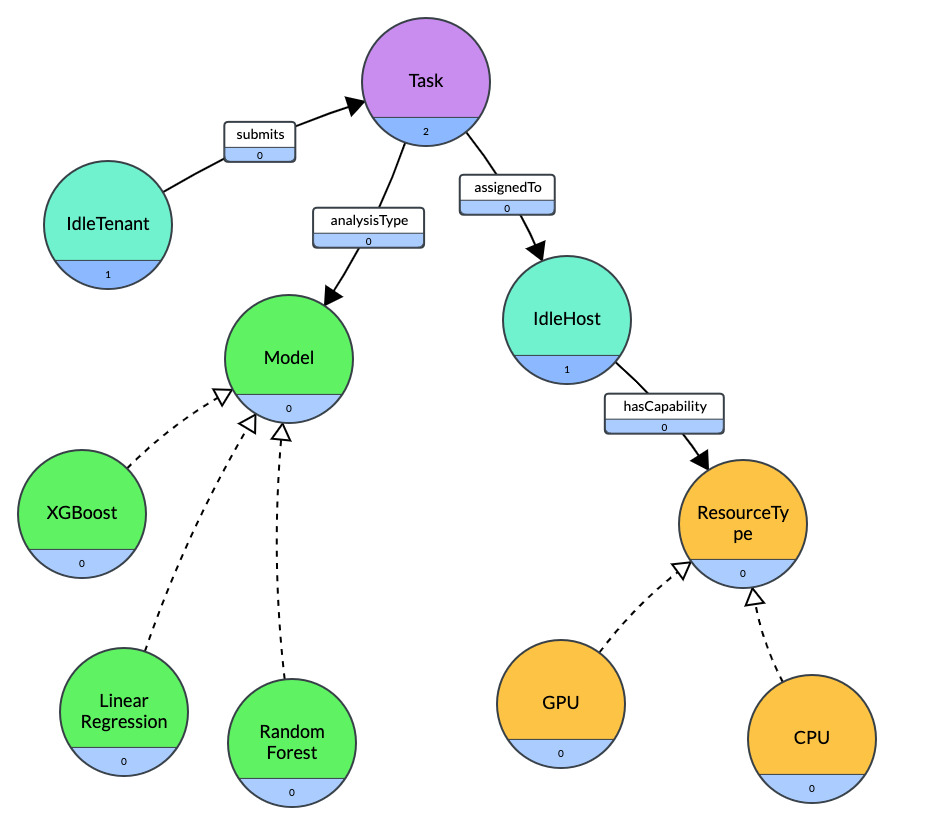

# IdleCompute Data Management Architecture


## Table of contents

- [Getting Started](#getting-started)
  - [Running the App](#running-the-app)
- [The Use Case](#the-use-case)
  - [Pipeline Highlights](#pipeline-highlights)
- [How the Data Pipeline Works](#how-the-data-pipeline-works)
- [Knowledge Graph Queries](#knowledge-graph-queries)
- [Outstanding Major Issues](#outstanding-major-issues)
  - [Distributing Work](#distributing-work)
  - [Security](#security)
- [Authors](#authors)
  - [Adam Broniewski](#adam-broniewski) -> [GitHub](https://github.com/abroniewski) | [LinkedIn](https://www.linkedin.com/in/abroniewski/) | [Website](https://adambron.com)
  - [Vlada Kylynnyk](#vlada-kylynnyk) -> [GitHub](https://github.com/Vladka396)
- [License](#license)

## Getting Started

This project has a single branch: `main`

The project has the structure below:

```	
IdleCompute-Data-Management-Architecture
├── LICENSE.md
├── Pipfile
├── Pipfile.lock
├── README.md
├── data
│   ├── admin
│   └── raw
├── docs
│   ├── BDM-Project1-Report.pdf
│   ├── BDM-Project2-Report.pdf
│   ├── DataPipeline.png
│   └── IdleComputeSchedule.png
└── src
    ├── dataset_analytics.py
    ├── idle_host_list.py
    ├── knowledge_graph_ABOX.py
    ├── knowledge_graph_TBOX.py
    ├── knowledge_graph_queries.txt
    ├── knowledge_graph_run.py
    ├── landing_zone.py
    ├── main.py
    ├── partition_dataset.py
    ├── read_partitioned_dataset.py
    └── schedule_generation.py
```

### Running the App

1. clone the project
2. install dependencies using pipfile
3. run main.py. 

This will use the sample data provided in [data/raw](https://github.com/abroniewski/IdleCompute-Data-Management-Architecture/tree/main/data/raw) and run through the full data pipeline.

## The Use Case

This project is a proof of concept for a startup business called "IdleCompute", which aims to leverage idle computer time of individual computers to complete distributed processing. The idea is similar to seti@home or Folding@Home, but is agnostic to industry or academic setting.

The proof of concept is a data pipeline that stores a user uploaded dataset from csv or json format, lands it into a persistent storage in Parquet format, completes a parallelized exploratory data analysis, builds a linear regression model, and tests the model's accuracy.

### Pipeline Highlights
1. The pipeline is dataset agnostic. Model building and exploratory analysis is completed "blind" to the number of attributes in the data set.
2. Pipeline takes advantage of HDFS file system and Parquet hybrid file format for storage and distribution efficiency
3. Knowledge graphs are implemented to take advantage of relationship level queries for quality assurance measures

## How the Data Pipeline Works



1. A file structure is generated from the dataset filename to maintain metadata about each dataset and when it was uploaded. The datasets are landed in `data/processed`
2. The file is stored in HDFS files structure in Parquet format. This allows for flexibility in reading the data horizontally (rows) or vertically (columns).
3. A dummy schedule is read to determine when a particular dataset should be processed and which users on the distributed system should be used to complete the processing. Admin files like the schedule are stored in `data/admin`
4. The dataset is partitioned depending on the number of nodes that exist in the schedule using RDDs and Map/Reduce style operations
5. Partitioned dataset are stores in `data/partitioned`
6. The partitioned dataset has descriptive analytics completed. Dataset description is stored in `data/analyzed`, PNG plots are stored in `data/analyzed/plots` and serializable pickle format plots are in `data/analyzed/plots_serialized`
7. A predictive model is created and stored for future use in `data/analyzed/model`. The model accuracy is stored in `data/analyzed`

## Knowledge Graph Queries

Graph analytics were used to:
1. Identify the dataset contributors that contribute to Tasks that most (or fewest) users are interested in analyzing
2. Identifying related Resources (nodes) that can have analytical work units assigned for quality assurance

A dummy data-set was created to represent the relationship between data being analyzed and the nodes completing the analysis. The data generator is located here: `data/knowledge-graph/SDM_point.ipynb`. This data is used to generate an ABOX (schema) shown below and TBOX (instances/data) that are then queried in GraphDB after uploading the data.



The queries used in GraphDB can be found in the [knowledge_graph_queries.txt](https://github.com/abroniewski/IdleCompute-Data-Management-Architecture/tree/main/src/knowledge_graph_queries.txt) file.

To test the queries out:
1. Run [knowledge_graph_run.py](https://github.com/abroniewski/IdleCompute-Data-Management-Architecture/tree/main/src/knowledge_graph_run.py).
This will generate the two required turtle files that need to be uploaded to GraphDB to run queries required for analysis.
2. Create a new GraphDB database. For the configuration use the following settings:
   1. Ruleset:  “RDFS (Optimized)”, Disable owl:sameAs 
   2. Indexing ID size: 32-bit, enable predicate list index
3. SPARQL Query and Update. Copy the text from [knowledge_graph_queries.txt](https://github.com/abroniewski/IdleCompute-Data-Management-Architecture/tree/main/src/knowledge_graph_queries.txt) into the editor to run them
4. Download a free version of GraphDB and create a new GraphDB database. For the configuration use the following settings:
   1. Ruleset:  “RDFS (Optimized)”, Disable owl:sameAs 
   2. Indexing ID size: 32-bit, enable predicate list index


## Outstanding Major Issues
### Distributing Work
As a whole, the ability to land data, and complete analytics in a distributed manner while remaining "dataset agnostic" was accomplished. The most pressing difficulty is an inability to dictate which node in a cluster will handle which partition of a dataset. It is the view of the authors that using Hadoop "out of the box" in this manner will not be possible. Some manipulation of hadoop source code would be required to assign partitions to specific nodes.

As an example, [Folding@Home](https://foldingathome.org/?lng=en) makes use of [Cosm software](https://en.wikipedia.org/wiki/Cosm_(software)) to achieve its distribution. There is significant further work required far beyond this project to bring this to reality. 

### Security
To ensure security and keep each data partition tamper-proof, the system would need to be virtualized, meaning a virtual partition would need to be created on each node's machine. To ensure the accuracy of each computation, duplicates would need to be completed by different machines and compared against each other.

## Authors

#### Adam Broniewski

* [GitHub](https://github.com/abroniewski)
* [LinkedIn](https://www.linkedin.com/in/abroniewski/)
* [Website](https://adambron.com)

#### Vlada Kylynnyk

* [GitHub](https://github.com/Vladka396)

## License

`IdleCompute Data Management Architecture` is open source software [licensed as MIT][license].

[license]: https://github.com/abroniewski/LICENSE.md
